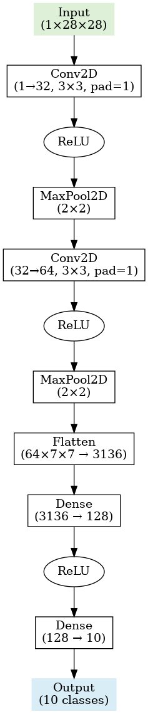

## Overview

Developed a Convolutional Neural Network (CNN) model trained on the MNIST dataset for handwritten digit recognition, achieving <strong>98.97%</strong> classification accuracy. The model effectively extracts spatial features through convolution and pooling layers, demonstrating strong generalization on unseen test data.

## Dataset

<b>Name:</b>MNIST Handwritten Digits 
<b>Size:</b> 70,000 grayscale images (60,000 training + 10,000 testing) 
<b>Image Size:</b> 28×28 pixels 
<b>Classes:</b> Digits from 0 to 9 

## Tech Stack

<b>Language:</b> Python 
<b>Framework:</b> PyTorch (Deep Learning), Flask (Web Backend) 
<b>Frontend:</b> HTML, CSS, JavaScript (Canvas API, Chart.js) 
<b>Libraries:</b> torch, torchvision – model training & inference 
&nbsp;&nbsp;&nbsp;&nbsp;PIL – image processing 
&nbsp;&nbsp;&nbsp;&nbsp;flask – serving predictions 
&nbsp;&nbsp;&nbsp;&nbsp;chart.js – probability visualization in browser 
Environment: Runs locally in browser for digit drawing and prediction

## CNN Model Architecture

  
  
<em>CNN: 1×28×28 → Conv(32) → ReLU → MaxPool → Conv(64) → ReLU → MaxPool → Flatten(3136) → FC(128) → FC(10)</em>

## How to Run Locally

### 1️⃣ Clone the repository

    git clone https://github.com/Pavitra2274/Handwritten-Digit-Recognition.git
    cd Handwritten-Digit-Recognition

### 2️⃣ Install dependencies

    pip install torch torchvision flask pillow

### 3️⃣ Make sure trained model file exists

    (Should be named mnist_cnn.pth in the project root)

### 4️⃣ Run Flask app

    python app.py

### 5️⃣ Open browser and visit

    http://127.0.0.1:5000/

### Usage:

Draw a digit (0–9) on the black canvas.

Click Predict to see the predicted digit and class probabilities as a bar chart.

Click Clear to reset the canvas.
